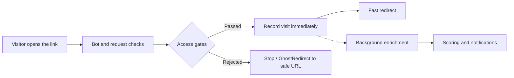
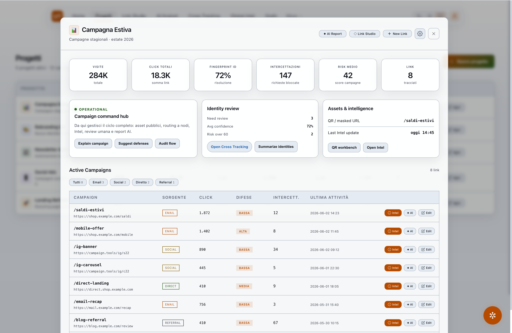
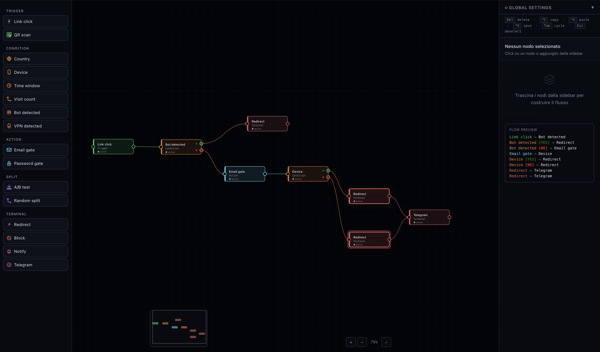
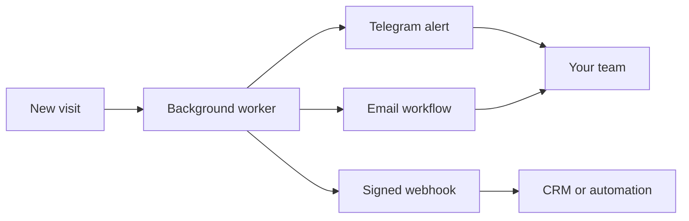

# UrlTrack

**Self-hosted link intelligence for analytics, routing, and traffic quality.**

UrlTrack turns ordinary links into a controlled intelligence layer. It combines
short links, access gates, visitor analytics, bot and VPN filtering, lead
history, exports, and optional AI analysis in one deployable application.

The project was built around a practical problem: most shorteners are useful
for click counts, but weak when a team needs to understand traffic quality,
segment visitors, protect destinations, and keep the data on infrastructure it
controls.

**[Open the interactive website](https://mn-company.github.io/UrlTrack/)**

## What it solves

- **Traffic quality**: identify bots, scanners, VPN/proxy traffic, repeat
  visitors, and suspicious sessions before treating a click as useful signal.
- **Controlled routing**: send visitors through password, CAPTCHA, email,
  consent, country, schedule, and device checks before redirecting.
- **Campaign intelligence**: connect links, visits, fingerprints, emails, and
  lead activity into a reviewable timeline.
- **Operational ownership**: run the application yourself instead of depending
  on a hosted analytics dashboard or opaque third-party shortener.
- **Exportable evidence**: move campaign data into CSV, JSON, PDF, webhooks,
  email workflows, or Telegram alerts.

## Core capabilities

- Short-link creation with destination protection and fallback redirects
- Visual routing flows for gates, conditions, splits, and notifications
- Visitor fingerprinting based on browser and device signals, with ThumbmarkJS
  used as the foundation for client-side fingerprint collection
- Bot, scanner, VPN, proxy, and hosting-provider checks
- Workspace separation, invitations, roles, TOTP, and passkey support
- Lead and visit timelines with device profiles and campaign-level analytics
- Optional Gemini-powered AI Analyst for scoped natural-language exploration of
  campaign data
- CSV, JSON, and PDF exports
- Telegram, SMTP email, and signed webhook integrations
- Python/Flask backend with SQLAlchemy, Alembic migrations, server-rendered UI,
  Docker support, and optional Supabase integration

## Architecture

The public redirect path is kept lightweight while slower enrichment work runs
in the background. Visitors move through the required checks without waiting for
scoring, notifications, or external integrations to finish.

- Server-rendered Flask pages with minimal browser overhead
- SQLAlchemy models and Alembic migrations
- Background enrichment for risk scoring, alerts, and webhooks
- Local sessions by default, with optional Supabase-backed authentication
- Docker and script-based setup paths
- Optional AI layer kept separate from core redirect and analytics logic

## How it works



Rejected traffic can be stopped or routed to a harmless fallback URL while
eligible traffic continues to the protected destination. This keeps the
destination out of the rejected flow and makes the link useful for legitimate
analytics, campaign safety, and controlled access.

### Destination protection comparison

| UrlTrack protected flow | Typical URL inspection tool |
| --- | --- |
|  |  |

The exact result depends on the client and configuration; this is a defensive
layer rather than a guarantee against every crawler.

## Demo

### Campaign Command Center

Monitor campaign health, identity confidence, risk, interceptions, and active
links from one operational view.



### Routing flow builder

Build visual routing flows with triggers, conditions, access gates, splits,
fallback destinations, and real-time notifications.



## Quick start

### Installer

The fastest way to run UrlTrack locally is:

```bash
git clone https://github.com/MN-company/UrlTrack.git
cd UrlTrack
./install.sh --run
```

The installer creates `.env` when needed, generates a secret key, prepares a
virtual environment, installs dependencies, applies migrations, and starts the
application.

Open [http://127.0.0.1:8000](http://127.0.0.1:8000), then create the first
owner account at `/register`.

### Docker Compose

```bash
git clone https://github.com/MN-company/UrlTrack.git
cd UrlTrack
./install.sh --docker --run
```

To prepare the environment without starting it immediately:

```bash
./install.sh --docker
docker compose up --build
```

The container applies Alembic migrations on boot and runs Gunicorn on port
`8000`. SQLite data is persisted in `server/data/`.

### Manual installation

Requirements:

- Python 3
- `pip` and `venv`
- a supported SQLAlchemy database; SQLite is the default

```bash
python3 -m venv venv
source venv/bin/activate
pip install -r server/requirements.txt
cp .env.example .env
SKIP_BACKGROUND_WORKER=1 python -m flask --app server:create_app db upgrade
./run.sh
```

Minimal configuration:

```env
SECRET_KEY=replace-with-a-long-random-value
SERVER_URL=http://127.0.0.1:8000
DATABASE_URL=sqlite:///data/urltrack.db
```

## First-run checklist

1. Open `/register` and create the first owner.
2. Name the initial workspace.
3. Create a link and choose the gates required for its audience.
4. Confirm that `SERVER_URL` matches the public base URL.
5. Enable TOTP or register a passkey from Security settings.
6. Configure retention, proxy trust, and integrations before production use.

Further users join by invitation. Workspace roles are `viewer`, `analyst`,
`editor`, `admin`, and `owner`.

## Integrations

UrlTrack works as a standalone application, but its most useful integrations
are built directly into the normal campaign workflow.

### Supabase

Connect Supabase to add managed authentication while preserving UrlTrack's
local sessions, workspaces, roles, passkeys, and security settings. Teams can
start with local accounts and introduce Supabase when the installation grows,
without changing how campaigns and analytics are organized.

### AI Analyst

The AI Analyst turns campaign data into a searchable operational view. It can
reason over visits, links, fingerprints, IP addresses, emails, and leads using
scoped references, while streaming responses directly in the interface.

The analysis layer is designed to remain separate from tracking and can be
extended to different model providers. Gemini support is included out of the
box, and AI remains completely optional: links and analytics continue to work
when no model is configured.

### Notifications and webhooks



- **Telegram** delivers real-time visit alerts and campaign updates.
- **Email via SMTP** handles team invitations and collaborative workflows.
- **Signed webhooks** forward events to CRMs, internal tools, or automation
  platforms.

Integrations can be configured per workspace, allowing separate teams to use
their own destinations and credentials. None of them are required for the core
redirect and analytics flow.

## Project status

UrlTrack is under active development. The core redirect, gating, analytics,
workspace, lead, export, and authentication flows are present, while advanced
correlation and AI-assisted features should be treated as experimental. Data
models and configuration may change between releases until a stable versioning
policy is introduced.

Current areas of work include:

- improving documentation and deployment examples
- expanding automated coverage for dashboard workflows
- refining visitor scoring and identity correlation
- making privacy and retention controls easier to audit
- improving observability for background enrichment jobs

This section is intentionally a direction rather than a release promise.

## Troubleshooting

### The wrong application starts or `/` returns an unexpected response

Use the repository virtual environment explicitly and stop stale development
processes:

```bash
pkill -f "flask --app server:create_app run" || true
./venv/bin/python -m flask --app server:create_app run --host=127.0.0.1 --port=8000
```

### `flask db` reports that the command does not exist

```bash
./venv/bin/python -m flask --app server:create_app db upgrade
```

### Telegram notifications do not arrive

Check that the bot token and chat ID are correct and that the target chat has
sent at least one message to the bot.

### Docker starts with dependency warnings

Check whether migrations completed and Gunicorn started successfully:

```bash
docker compose ps
docker compose logs --tail=200
```

## Responsible use

UrlTrack is provided for educational, research, and legitimate analytics use.
It is not designed to establish a person's real-world identity, bypass consent,
or facilitate harassment, surveillance, credential collection, or unauthorized
access. Operators are responsible for informing visitors where required,
collecting valid consent, minimizing retained data, and securing their
deployment.

## License

Distributed under the terms in [LICENSE](LICENSE).
